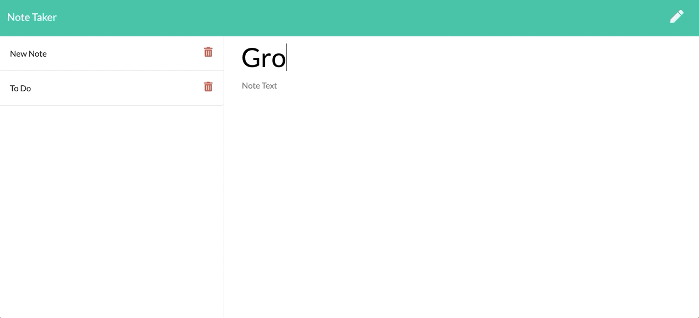
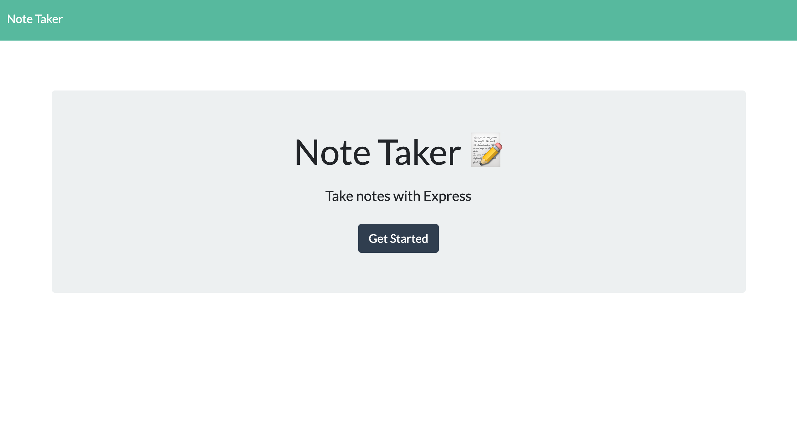

# 
Note Taker

Live Link: [https://jm-notetaker.herokuapp.com/](https://jm-notetaker.herokuapp.com/)

## 📝 About

A simple note taking application built with Express and Node. The user can create new notes and save them to the hosted api, as well as delete any notes from the api and from the page.

***
## Preview

***
## Table of Contents
1. [Technologies and Languages](#technologies-&-languages)
2. [Usage](#usage)
3. [License](#license)
4. [Contributing](#contributing)
5. [Contact Me](#contact-me)

***
## Technologies & Languages

* Javascript
* Node.js
* Express.js
* Bootstrap
* CSS
* HTML
* Heroku

***
## Usage

Click the pencil icon on the right to begin new note. Then type into the text fields and save new notes by pressing the save icon in the top right corner. All created notes are stored in a column on the left, and can be deleted by the adjacent button on the listed note title.

***
## License

***
## Contributing

[@jeffreymcfarland](https://github.com/jeffreymcfarland)

***
## Contact Me    

<kbd></kbd> 
* Email: <jlmcfarlandj@gmail.com>
